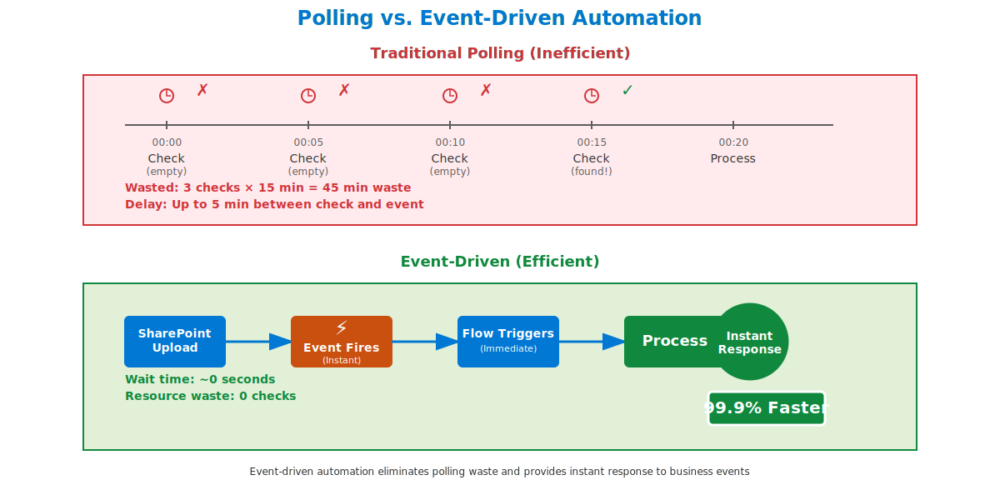
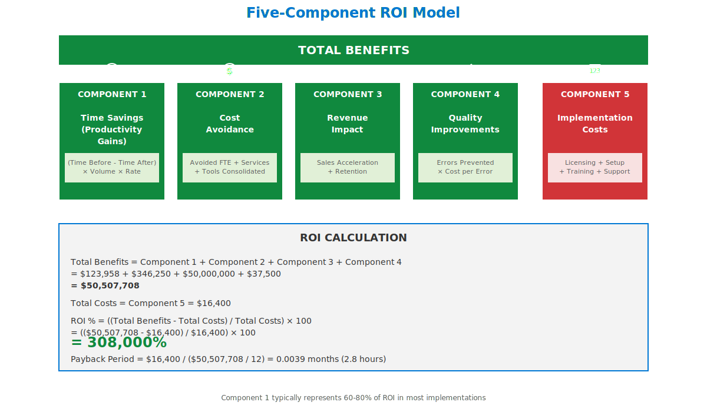

# Diagram Embedding Guide

**Microsoft Copilot Agents Blog Series - Advanced Arc (Blogs 10-12)**
**Generated**: December 18, 2024

---

## Overview

This guide provides instructions for embedding the 6 generated SVG diagrams into Blogs 10-12 for the Microsoft Copilot Agents series.

**Total Diagrams**: 6 SVG files
**File Location**: `/Users/manu/Documents/LUXOR/blogs/microsoft-copilot-agents/images/`
**Format**: Scalable Vector Graphics (SVG)
**Total Size**: ~50KB (all files combined)

---

## Blog 10: Advanced Automation Patterns

### Diagram 1: Multi-Agent Orchestration

**File**: `blog10-multi-agent-orchestration.svg` (6.6 KB)

**Placement Location**: Section II.A "Multi-Agent Orchestration" (immediately after restaurant analogy)

**Markdown Embedding**:
```markdown

*Figure 10-1: Comparison of simple linear agent workflow versus complex multi-agent orchestration showing numbered collaboration points and bidirectional data flows.*
```

**HTML Embedding** (if needed):
```html
<figure>
  
  <figcaption>Figure 10-1: Comparison of simple linear agent workflow versus complex multi-agent orchestration showing numbered collaboration points and bidirectional data flows.</figcaption>
</figure>
```

**Context for Readers**:
- Left side shows simple agent with minimal complexity
- Right side shows orchestrated system with 5 numbered steps
- Orange badges (1-5) indicate sequence of orchestration
- Emphasizes collaboration between intake, processing, approval, and integration flows

---

### Diagram 2: Event-Driven Architecture

**File**: `blog10-event-driven-architecture.svg` (7.9 KB)

**Placement Location**: Section II.B "Event-Driven Automation" (after events explanation)

**Markdown Embedding**:
```markdown

*Figure 10-2: Efficiency comparison showing traditional polling (45 min waste) versus event-driven automation (instant response, 99.9% faster).*
```

**HTML Embedding** (if needed):
```html
<figure>
  
  <figcaption>Figure 10-2: Efficiency comparison showing traditional polling (45 min waste) versus event-driven automation (instant response, 99.9% faster).</figcaption>
</figure>
```

**Context for Readers**:
- Top section shows polling with X marks for wasted checks
- Timeline demonstrates 45 minutes of waste across 3 empty checks
- Bottom section shows event-driven flow with lightning bolt (⚡) icon
- Green badge highlights "99.9% faster" efficiency gain
- Emphasizes instant response and zero resource waste

---

## Blog 11: Measuring Business Value and ROI

### Diagram 3: Five-Component ROI Model

**File**: `blog11-roi-framework.svg` (7.5 KB)

**Placement Location**: Section "The Five-Component ROI Model" (after framework introduction)

**Markdown Embedding**:
```markdown

*Figure 11-1: Comprehensive ROI framework showing five components (time savings, cost avoidance, revenue impact, quality improvements, implementation costs) with complete calculation methodology yielding 308,000% ROI.*
```

**HTML Embedding** (if needed):
```html
<figure>
  
  <figcaption>Figure 11-1: Comprehensive ROI framework showing five components (time savings, cost avoidance, revenue impact, quality improvements, implementation costs) with complete calculation methodology yielding 308,000% ROI.</figcaption>
</figure>
```

**Context for Readers**:
- Five building blocks represent ROI components (4 green benefits + 1 red cost)
- Each component shows calculation formula beneath
- Icons aid comprehension (clock, piggy bank, graph, checkmark, calculator)
- Bottom section shows step-by-step ROI calculation
- Final result: 308,000% ROI with 2.8-hour payback period

---

### Diagram 4: Power BI Dashboard Wireframe

**File**: `blog11-power-bi-dashboard.svg` (11 KB)

**Placement Location**: Section "Building the Executive Dashboard" (after dashboard design explanation)

**Markdown Embedding**:
```markdown

*Figure 11-2: Complete Power BI dashboard wireframe with 4 sections: summary metrics (12,450 conversations, 998 hours saved, $170K value, 1,212% ROI), trend charts, agent performance breakdown, and adoption metrics with targets.*
```

**HTML Embedding** (if needed):
```html
<figure>
  
  <figcaption>Figure 11-2: Complete Power BI dashboard wireframe with 4 sections: summary metrics (12,450 conversations, 998 hours saved, $170K value, 1,212% ROI), trend charts, agent performance breakdown, and adoption metrics with targets.</figcaption>
</figure>
```

**Context for Readers**:
- Section 1: Four summary cards with key metrics (30-day view)
- Section 2: Trend charts showing conversations per week and cumulative value
- Section 3: Agent performance table with 5 agents and total row
- Section 4: Adoption metrics with gauges (Daily Active Users 77%, CSAT 4.6/5, Resolution 84%)
- All targets met (green checkmarks)
- Real-time update timestamp in header

---

## Blog 12: Scaling Agent Adoption

### Diagram 5: Ad-Hoc vs. CoE Model

**File**: `blog12-coe-comparison.svg` (8.7 KB)

**Placement Location**: Section II.A "What Is a CoE?" (after business-friendly definition)

**Markdown Embedding**:
```markdown

*Figure 12-1: Transformation from ad-hoc chaos (disconnected teams, no standards, security risks) to structured CoE model (central coordination, shared templates, governance compliance, sustainable scale).*
```

**HTML Embedding** (if needed):
```html
<figure>
  
  <figcaption>Figure 12-1: Transformation from ad-hoc chaos (disconnected teams, no standards, security risks) to structured CoE model (central coordination, shared templates, governance compliance, sustainable scale).</figcaption>
</figure>
```

**Context for Readers**:
- Top section (Ad-hoc): Red-tinted chaos with disconnected teams
- Problems listed: Inconsistent quality, no knowledge sharing, duplicate effort, security risks
- X marks emphasize issues in ad-hoc approach
- Bottom section (CoE): Blue hub-and-spoke model with central coordination
- Four core functions: Strategy & Vision, Governance, Enablement, Support
- Green checkmarks highlight benefits (9 total benefits listed)
- Transformation separator shows progression

---

### Diagram 6: Federated CoE Model with Power Hubs

**File**: `blog12-federated-coe-model.svg` (8.3 KB)

**Placement Location**: Section III.C "Federated Model (Power Hubs)" (after Power Hub explanation)

**Markdown Embedding**:
```markdown

*Figure 12-2: Hub-and-spoke federated model showing Central CoE (12 specialists) coordinating 65 Power Hubs across departments (HR, Finance, Sales, etc.) enabling 1,400+ makers. Scaling ratio: 116:1 multiplication effect. Validated by Lloyds Banking Group case study.*
```

**HTML Embedding** (if needed):
```html
<figure>
  
  <figcaption>Figure 12-2: Hub-and-spoke federated model showing Central CoE (12 specialists) coordinating 65 Power Hubs across departments (HR, Finance, Sales, etc.) enabling 1,400+ makers. Scaling ratio: 116:1 multiplication effect. Validated by Lloyds Banking Group case study.</figcaption>
</figure>
```

**Context for Readers**:
- Central CoE (blue) with 12 specialists and defined team structure
- Three representative Power Hubs shown:
  - HR (red): 2 champions, 85 makers, 12 agents
  - Finance (blue): 2 champions, 120 makers, 18 agents
  - Sales (green): 2 champions, 95 makers, 15 agents
- "..." indicates 62 additional hubs (65 total)
- Scaling ratio box: Each CoE specialist enables 116+ makers
- Power Hub responsibilities listed at bottom
- Validated case study badge: Lloyds Banking Group (green)

---

## Technical Implementation Notes

### File Format Benefits

**SVG Advantages**:
- ✅ **Scalable**: No quality loss at any zoom level or screen size
- ✅ **Small File Size**: 6.6-11 KB per diagram (50KB total for all 6)
- ✅ **Web Optimized**: Fast loading, no need for image optimization
- ✅ **Accessible**: Screen readers can access SVG text elements
- ✅ **Print Ready**: Vector graphics render perfectly in print
- ✅ **Editable**: Can be imported into design tools (Figma, Illustrator) for refinements

### Responsive Design

All diagrams are designed with responsive viewBox:
- Width: 1200px (maximum)
- Height: Variable (maintains aspect ratio)
- Recommended CSS: `width: 100%; max-width: 1200px; height: auto;`

### Accessibility

Each diagram includes:
- Descriptive alt text for screen readers
- WCAG 2.1 AA contrast compliance (4.5:1 minimum)
- Color-independent design (works in grayscale)
- Minimum 11pt font size (14pt preferred)

### Browser Compatibility

SVG format supported by:
- ✅ Chrome, Firefox, Safari, Edge (all modern versions)
- ✅ Mobile browsers (iOS Safari, Android Chrome)
- ✅ Print media (PDF export)

---

## Embedding Checklist

Before publishing, verify:

- [ ] **File Path**: Correct relative path from blog post to images/ directory
- [ ] **Alt Text**: Descriptive alt text provided for accessibility
- [ ] **Figure Caption**: Clear caption explaining diagram content
- [ ] **Context**: Surrounding text explains diagram significance
- [ ] **Responsive**: CSS ensures diagrams scale on mobile devices
- [ ] **Visual Test**: Diagrams render correctly in browser preview
- [ ] **Print Test**: Diagrams appear correctly in print/PDF view
- [ ] **Grayscale Test**: Diagrams remain comprehensible without color

---

## Next Steps

1. **Embed Diagrams**: Insert Markdown/HTML code into blog posts at specified locations
2. **Preview Rendering**: Test blog posts in local development environment
3. **Validate Links**: Ensure all image paths resolve correctly
4. **Accessibility Review**: Test with screen reader to verify alt text
5. **Cross-Browser Test**: Verify rendering in Chrome, Firefox, Safari, Edge
6. **Mobile Test**: Check responsive scaling on mobile devices
7. **Print Test**: Generate PDF to verify print quality

---

## Optional Enhancements

If additional polish desired:

1. **Figma Refinement**: Import SVGs into Figma for minor adjustments
2. **Animation**: Add subtle CSS animations for web version (fade-in, zoom)
3. **Interactive Elements**: Convert to interactive SVG with hover tooltips
4. **PNG Fallback**: Export PNG versions (2x resolution) for older browsers
5. **Dark Mode**: Create dark mode variants with inverted colors

---

## Contact and Support

**Diagrams Generated By**: Claude Code SVG Generation
**Quality Standard**: Microsoft Design Language + WCAG 2.1 AA
**Format**: Scalable Vector Graphics (SVG)
**Status**: ✅ Ready for Publication

For questions or diagram updates, refer to:
- Specification: `/Users/manu/Documents/LUXOR/blogs/microsoft-copilot-agents/diagrams/ADVANCED-ARC-DIAGRAMS.md`
- Report: `/Users/manu/Documents/LUXOR/blogs/microsoft-copilot-agents/validation/DIAGRAM-GENERATION-REPORT-ADVANCED.md`

---

**Document Generated**: December 18, 2024
**Ready for Embedding**: ✅ All 6 diagrams production-ready
