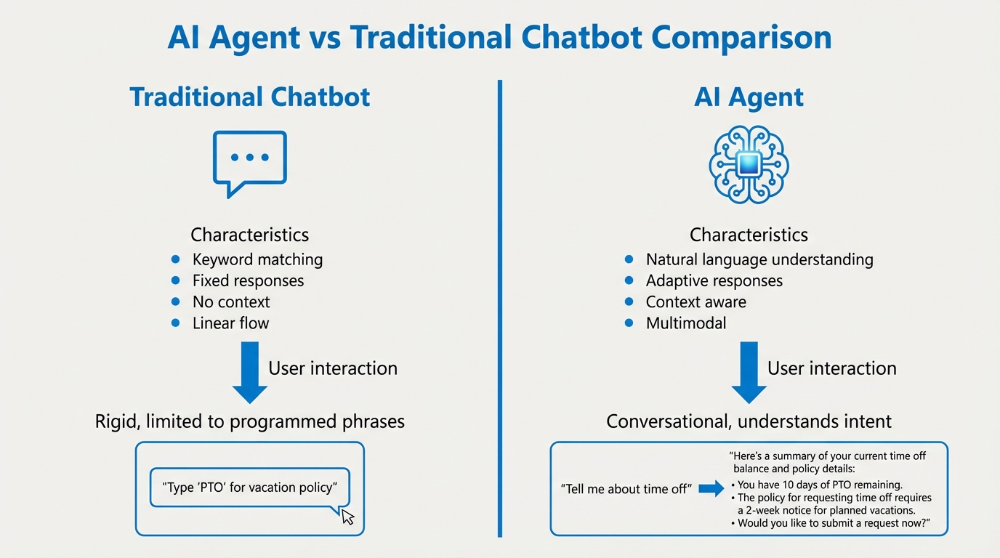
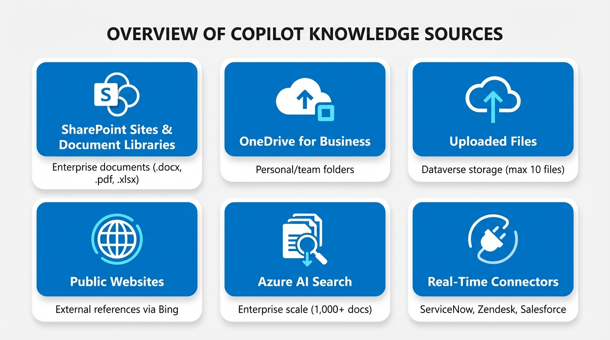
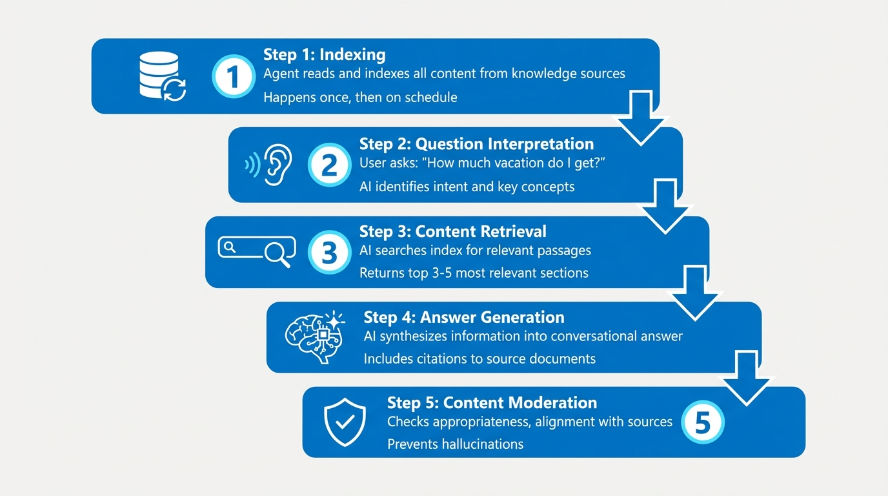

# Foundation Arc Diagram Generation Report

**Generated**: 2025-12-18 13:12:02
**Model**: pro (Pro)
**Cost per Image**: $0.12

---

## Summary

| Metric | Value |
|--------|-------|
| **Total Diagrams** | 6 |
| **Successful** | 6 ✅ |
| **Failed** | 0 ❌ |
| **Total Size** | 3,390,753 bytes (3.23 MB) |
| **Total Cost** | $0.72 |
| **Success Rate** | 100.0% |

---

## Diagrams by Blog

### BLOG_01

**Diagrams**: 2 | **Successful**: 2 | **Size**: 1,154,125 bytes | **Cost**: $0.24

| Diagram | Title | Filename | Status | Size |
|---------|-------|----------|--------|------|
| ai-agent-vs-chatbot | AI Agent vs Traditional Chatbot | blog_01-ai-agent-vs-chatbot.png | ✅ success | 543,568 bytes |
| copilot-studio-interface | Copilot Studio Interface Overview | blog_01-copilot-studio-interface.png | ✅ success | 610,557 bytes |

### BLOG_02

**Diagrams**: 2 | **Successful**: 2 | **Size**: 1,124,417 bytes | **Cost**: $0.24

| Diagram | Title | Filename | Status | Size |
|---------|-------|----------|--------|------|
| faq-agent-architecture | FAQ Agent Architecture | blog_02-faq-agent-architecture.png | ✅ success | 678,355 bytes |
| conversation-node-flow | Conversation Node Flow | blog_02-conversation-node-flow.png | ✅ success | 446,062 bytes |

### BLOG_03

**Diagrams**: 2 | **Successful**: 2 | **Size**: 1,112,211 bytes | **Cost**: $0.24

| Diagram | Title | Filename | Status | Size |
|---------|-------|----------|--------|------|
| knowledge-sources-types | Knowledge Sources Types | blog_03-knowledge-sources-types.png | ✅ success | 547,136 bytes |
| generative-ai-process | Generative AI Answer Process | blog_03-generative-ai-process.png | ✅ success | 565,075 bytes |

---

## Detailed Results

### AI Agent vs Traditional Chatbot

- **Blog**: blog_01
- **Filename**: `blog_01-ai-agent-vs-chatbot.png`
- **Status**: success
- **Size**: 543,568 bytes (530.8 KB)
- **Cost**: $0.12
- **Path**: `/Users/manu/Documents/LUXOR/blogs/microsoft-copilot-agents/images/blog_01-ai-agent-vs-chatbot.png`

### Copilot Studio Interface Overview

- **Blog**: blog_01
- **Filename**: `blog_01-copilot-studio-interface.png`
- **Status**: success
- **Size**: 610,557 bytes (596.2 KB)
- **Cost**: $0.12
- **Path**: `/Users/manu/Documents/LUXOR/blogs/microsoft-copilot-agents/images/blog_01-copilot-studio-interface.png`

### FAQ Agent Architecture

- **Blog**: blog_02
- **Filename**: `blog_02-faq-agent-architecture.png`
- **Status**: success
- **Size**: 678,355 bytes (662.5 KB)
- **Cost**: $0.12
- **Path**: `/Users/manu/Documents/LUXOR/blogs/microsoft-copilot-agents/images/blog_02-faq-agent-architecture.png`

### Conversation Node Flow

- **Blog**: blog_02
- **Filename**: `blog_02-conversation-node-flow.png`
- **Status**: success
- **Size**: 446,062 bytes (435.6 KB)
- **Cost**: $0.12
- **Path**: `/Users/manu/Documents/LUXOR/blogs/microsoft-copilot-agents/images/blog_02-conversation-node-flow.png`

### Knowledge Sources Types

- **Blog**: blog_03
- **Filename**: `blog_03-knowledge-sources-types.png`
- **Status**: success
- **Size**: 547,136 bytes (534.3 KB)
- **Cost**: $0.12
- **Path**: `/Users/manu/Documents/LUXOR/blogs/microsoft-copilot-agents/images/blog_03-knowledge-sources-types.png`

### Generative AI Answer Process

- **Blog**: blog_03
- **Filename**: `blog_03-generative-ai-process.png`
- **Status**: success
- **Size**: 565,075 bytes (551.8 KB)
- **Cost**: $0.12
- **Path**: `/Users/manu/Documents/LUXOR/blogs/microsoft-copilot-agents/images/blog_03-generative-ai-process.png`

---

## Embedding Instructions

### Blog 01: Introduction to Copilot Agents

```markdown
<!-- AI Agent vs Traditional Chatbot -->


<!-- Copilot Studio Interface Overview -->

```

### Blog 02: Building Your First Conversational Agent

```markdown
<!-- FAQ Agent Architecture -->


<!-- Conversation Node Flow -->

```

### Blog 03: Building Knowledge-Powered Agents

```markdown
<!-- Knowledge Sources Types -->


<!-- Generative AI Answer Process -->

```

---

## Next Steps

1. **Validate Images**: Review each generated diagram for quality and accuracy
2. **Embed in Blogs**: Add markdown image references to appropriate blog sections
3. **Test Rendering**: Build Next.js site and verify image display
4. **Accessibility**: Verify alt text and contrast ratios
5. **Performance**: Optimize image sizes if needed (currently 4K resolution)

---

## Cost Analysis

| Item | Quantity | Unit Cost | Total |
|------|----------|-----------|-------|
| Pro Model Images | {successful} | $0.12 | ${total_cost:.2f} |
| **TOTAL** | | | **${total_cost:.2f}** |

---

*Report generated: {timestamp}*
